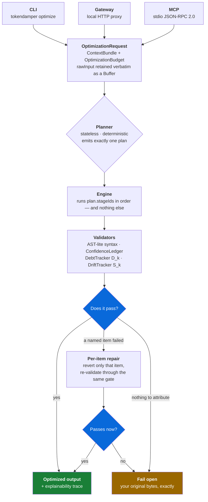
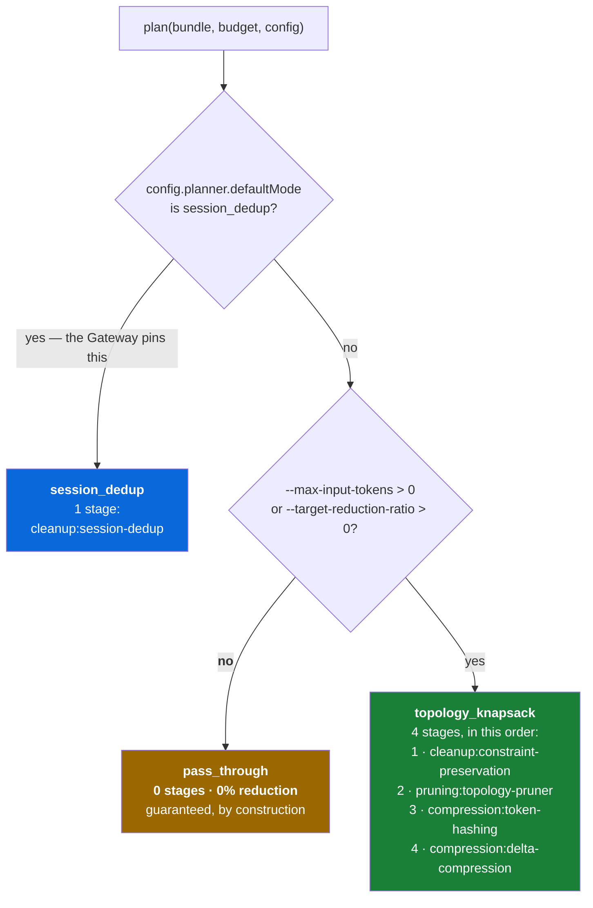
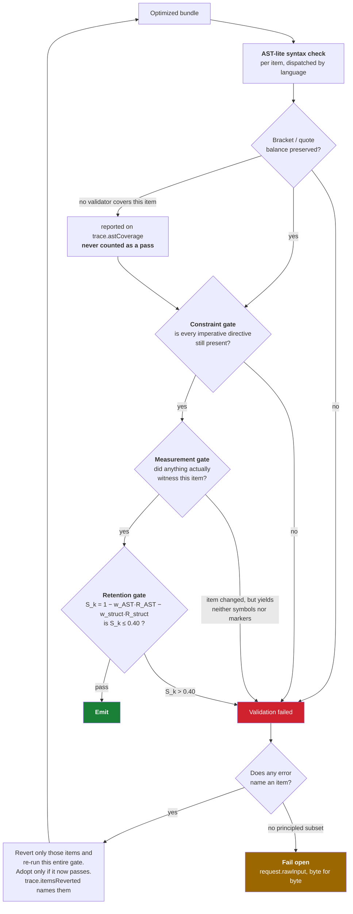

<h1 align="center">TokenDamper</h1>

<p align="center">
  <strong>A deterministic context optimization engine for AI coding assistants.</strong><br>
  Same bytes in, same bytes out — every time. No model in the loop, no summarizer, no guessing.
</p>

<p align="center">
  <a href="#license"></a>
  <a href="https://www.npmjs.com/package/tokendamper"></a>
  
  
</p>

---

TokenDamper sits between your developer tool and an LLM provider and removes context you are
paying for but do not need — function bodies, duplicated blocks, files the task cannot reach.

It is not a summarizer. There is no second model, no embedding, no temperature. Every transform is
a pure function of its input, so the same bundle produces the same bytes on every run, on every
machine. When a check cannot certify the result, you get **your original bytes back, unchanged** —
never a crash, and never a quietly damaged payload.

**The differentiator is not the reduction percentage.** It is determinism, a stated and measured
syntactic guarantee, and a fail-open path that is byte-exact. Anything that weakens those defeats
the point of the project.

> **Every number in this document was produced by a command you can run.** Where a figure comes
> from a frozen corpus rather than a one-liner, the corpus and the commit are named. Where a
> feature does not work, or works less well than you would assume, this README says so and shows
> the measurement — see [What it does not do](#what-it-does-not-do), which is not an appendix but
> a load-bearing section.

---

## Table of contents

- [The 60-second version](#the-60-second-version)
- [How it works](#how-it-works)
- [Install](#install)
- [Usage](#usage)
- [What it actually saves](#what-it-actually-saves)
- [What it does not do](#what-it-does-not-do)
- [Reference](#reference)
- [Project state](#project-state)
- [License](#license)

---

## The 60-second version

Take a Python module — an order book with four methods:

```python
import hashlib
from decimal import Decimal


class OrderBook:
    """Tracks open orders for a single trading pair."""

    def __init__(self, pair):
        self.pair = pair
        self.bids = []
        self.asks = []

    def add_bid(self, price, size):
        """Insert a bid, keeping the book sorted best-first."""
        entry = (Decimal(price), Decimal(size))
        index = 0
        while index < len(self.bids) and self.bids[index][0] > entry[0]:
            index += 1
        self.bids.insert(index, entry)
        self._rebalance()
        return len(self.bids)

    # ... add_ask, _rebalance and checksum follow, in the same shape
```

Run it:

```bash
tokendamper optimize orders.py --target-reduction-ratio 0.4
```

Out comes this — the shape of the module intact, the bodies replaced by a marker that says exactly
what was taken and carries a digest of it:

```python
import hashlib
from decimal import Decimal


class OrderBook:
    """Tracks open orders for a single trading pair."""

    def __init__(self, pair):
        self.pair = pair
        self.bids = []
        self.asks = []

    def add_bid(self, price, size):
        [TokenDamper: 8 function-body lines elided, 312 bytes, sha256:bfaff473fa56]

    def add_ask(self, price, size):
        [TokenDamper: 8 function-body lines elided, 313 bytes, sha256:524a80d4dcd9]

    def _rebalance(self):
        [TokenDamper: 15 function-body lines elided, 608 bytes, sha256:5bd97a4903d8]

    def checksum(self):
        [TokenDamper: 8 function-body lines elided, 353 bytes, sha256:926ed78613d2]
```

**1,968 bytes → 683 bytes. 609 tokens → 196.** The model still sees every import, every class,
every signature and every argument name — the things it needs to call this code correctly — and
none of the loop bodies it does not.

And on stderr, a full explainability trace, because a reduction you cannot audit is a liability:

```jsonc
{
  "planMode": "topology_knapsack",
  "stageCount": 4,
  "tokenBefore": 609,
  "tokenAfter": 196,
  "fallbackUsed": false,
  "driftScore": 0,
  "astCoverage":     { "checked": 1, "unchecked": 0, "uncheckedContentTypes": [] },
  "driftCoverage":   { "measured": true, "astMeasured": true, "symbolsBefore": 8,
                       "symbolBearingItems": 1, "unwitnessedItems": [] },
  "languageSupport": { "supported": 1, "unsupported": 0, "noneSupported": false }
}
```

Read `astCoverage` and `driftCoverage`, not just `driftScore`. A `0` meaning *"we looked and
nothing was lost"* and a `0` meaning *"nothing looked"* are the same number; the coverage fields
are what tell them apart. That distinction has cost this project ten separate bugs, and guarding
it is [the gate's whole job](#the-gate-that-decides-whether-you-get-any-of-it).

<details>
<summary><strong>Two more one-liners on the same file</strong></summary>

```bash
# Keep the docstring, lose only the body — the "why" survives the "how".
tokendamper optimize orders.py --target-reduction-ratio 0.4 --keep-docstrings
# 609 -> 273 tokens, and every docstring is still there.

# No budget flag at all.
tokendamper optimize orders.py
# 609 -> 609 tokens. planMode "pass_through", stageCount 0. This is not a bug — see below.
```

</details>

---

## How it works

### The pipeline

Three entry modes converge on one engine. There is no DAG, no plugin loader and no dynamic
strategy generation — the pipeline is linear on purpose, because that is what makes it
reproducible.



### Planning: three plans, and one of them does nothing

This is the single most misread thing in the project, so it gets its own diagram. **With no budget
flag the planner selects `pass_through`, which has an empty stage list. Zero stages run and the
reduction is guaranteed 0%.** That is the design, not a defect — it has been filed as a bug more
than once.



**Always pass a budget when you want a reduction.** `--target-reduction-ratio 0.3` is the usual
one.

### The four stages

| # | Stage | What it does |
|---|---|---|
| 1 | `cleanup:constraint-preservation` | Finds imperative directives in the input — `TD_PRESERVE`, `must`, `never`, file paths, line numbers, API URLs — and records them as *critical atoms*. Nothing may later drop one without failing validation. This is what stops a compressor from deleting the one line that said "do not retry on 4xx". |
| 2 | `pruning:topology-pruner` | The **0/1 knapsack**. Scores every item by dependency-graph distance to your dirty files, git status, item kind and constraint density, then packs the highest-value set under the token budget. Weights are quantized to 1,024-token cache blocks and the pinned prefix keeps its exact order, so provider prompt caches still hit. Pinned items bypass the knapsack entirely. |
| 3 | `compression:token-hashing` | The **elision** engine, and where most of the saving comes from. Selects function bodies — and, since v1.4.0, statement runs *inside* them — and replaces each with a self-describing marker carrying a SHA-256 prefix. Smallest-region-first when a ceiling is set, so it stops at your target rather than running to exhaustion. |
| 4 | `compression:delta-compression` | Line-based **Myers diff** against a previous version of the same file, so a modified file costs its diff rather than its blob. Needs a base version, which the one-shot CLI route does not have. |

`cleanup:session-dedup` is a fifth stage in the registry, reachable **only** through
`session_dedup` mode. It never runs on the CLI or MCP paths — see
[the Gateway](#the-gateway-is-experimental-and-saves-nothing-across-turns).

### Anatomy of an elision

```text
[TokenDamper: 15 function-body lines elided, 608 bytes, sha256:5bd97a4903d8]
 └────┬───┘   └┬┘  └─────┬──────┘          └──┬──┘         └──────┬─────┘
   issuer    count   what was taken         size          first 12 hex of the
                                                          SHA-256 of the content
```

The rule this satisfies: **on a one-shot path, an elision must carry enough in-band for a reader
with no external state to know what was removed.** An opaque `<BLOCK_HASH:4af5…>` told its reader
that *something* was there — not what, not how much, not whether it mattered. The marker costs
~77 bytes, which is why regions below 104 bytes are never elided: taking them would cost more
than it saves.

Twelve hex characters is *provenance*, not a globally unique key. A caller holding the original
content can verify against it, and a prefix collision costs a failed rehydration, never a wrong
one.

### The gate that decides whether you get any of it

Compression is the easy half. The interesting half is refusing to ship a bad result — and, harder,
refusing to ship a result that **nothing checked**.



Three things about this are unusual, and deliberate.

**1. The measurement gate and the retention gate are two gates, not one threshold.** `0.400` used
to arbitrate two opposite questions — *did enough survive?* and *was anything watching?* — so a
file nothing could measure scored a perfect `0.0000` and sailed through. One real case: a
57,037-token Perl file reduced to **19 tokens**, `S_k = 0`, `fallbackUsed: false`, because nothing
covers `.pl`. Now an item that changed and yields no witness is **refused**, whether or not a
validator covers it. Every uncovered-language bucket goes to 0.00% reduction as a result, and 258
of 258 rows in the covered buckets stayed byte-identical.

**2. A failure that names an item reverts that item, not your whole bundle.** Before this, one bad
file in a 45-file directory reverted all 45 and the run emitted 0.00% — with drift at 0.0359
against a 0.40 gate and the syntax check clean. Reverting the 14 named items instead yields
**22.73%** and re-validates clean. `trace.itemsReverted` names them, so a partial success cannot
be mistaken for a clean one.

**3. Repair decides nothing.** The repaired candidate goes back through the *same* `validate()`.
The mechanism changes which bundle is offered; it never changes what counts as valid.

Fail-open means the caller's *bytes*, not a re-encoding of them. The CLI holds the input as a
`Buffer` and writes that Buffer back, because `readFileSync(path, 'utf8')` turns invalid bytes
into `U+FFFD` before any stage runs — a Latin-1 shell script once came back **1,462 → 1,466 bytes**
with `fallbackUsed: true`. Byte-identity on fallback is now **504 of 504** corpus rows.

---

## Install

```bash
npm install -g tokendamper
```

Or add it to a project:

```bash
npm install tokendamper
```

Node `^20.19 || ^22.13 || >=24`. Zero runtime dependencies.

<details>
<summary><strong>From source</strong></summary>

```bash
git clone https://github.com/Epichlo/TokenDamper.git
cd TokenDamper
npm install
npm run build
node dist/src/cli/main.js optimize <file> --target-reduction-ratio 0.3
```

</details>

---

## Usage

```text
tokendamper optimize <file|dir|-> [...]    compress context
tokendamper exec -- <command>              wrap a tool, intercept its API calls
tokendamper mcp                            MCP stdio server
tokendamper bench [dataset]                offline benchmark harness
```

### One file

```bash
tokendamper optimize prompt.txt --target-reduction-ratio 0.3
tokendamper optimize src/service.ts --max-input-tokens 5000
```

Optimized bytes go to **stdout**; the trace and every warning go to **stderr**. Piping the output
somewhere never mixes the two.

### Several files, or a whole directory

More than one path builds a multi-item bundle — which is what gives the knapsack something to
select between.

```bash
tokendamper optimize src/a.py src/b.py --target-reduction-ratio 0.4
tokendamper optimize ./src --max-input-tokens 4000
```

A directory is walked recursively, sorted (order matters — prefix locking pins the first ~1,024
tokens), skipping `node_modules`, `dist`, `build`, `coverage`, `__pycache__` and every
dot-directory. Each file becomes one item, emitted under a `==> /absolute/path <==` header. A
single file is emitted bare, with no header.

Measured on a 12-module Python project, `--max-input-tokens 3000`:

```text
12 items · 8,005 tokens  ->  2,669 tokens   (66.66%)
  pruning:topology-pruner   pruned 8 · pinned 2 · selected 4 · saved 4,878 tokens
  fallbackUsed: false
```

…and on stderr, because a file that simply *is not there* is invisible to whatever reads the
output next:

```text
Warning: 8 of 12 file(s) were removed entirely to meet the token budget, not elided —
their contents are absent from the output with no marker:
  - .../mod_05.py
  ...
Lower --target-reduction-ratio, raise --max-input-tokens, or optimize files individually.
```

Pruning is not elision. Elision leaves a marker saying what it took; pruning leaves nothing at all,
and a model will not report a file it was never shown — it will infer an API and be confidently
wrong about it.

### stdin — and why `--language` matters

Optimization is language-aware: the validators, the region selector and the drift metric all
dispatch on the item's language, and a piped stream carries no filename to infer one from.

```bash
cat service.ts | tokendamper optimize - --language typescript --target-reduction-ratio 0.3
cat service.ts | tokendamper optimize - --input-name src/service.ts   # equivalent
```

The difference is not subtle. On one of this repository's own TypeScript sources:

| route | tokens | `astCoverage` |
|---|---|---|
| `optimize src/core/budget/index.ts` | 880 → **739** | `checked: 1` |
| `cat … \| optimize -` *(no declaration)* | 880 → **880** | `checked: 0, unchecked: 1, uncheckedContentTypes: ["text"]` |
| `cat … \| optimize - --language typescript` | 880 → **739** | `checked: 1` |

Without a declaration the content is probe-classified as prose. No validator covers it, no region
selector exists for it, so `compression:token-hashing` finds nothing eligible and skips the item —
`fallbackUsed` stays `false` and you simply get a silent 0%.

**Which is why the trace says so out loud rather than leaving you to infer it.** That middle row
also reports:

```jsonc
"languageSupport": {
  "supported": 0, "unsupported": 1, "unsupportedLanguages": ["text"], "noneSupported": true,
  "reason": "Elision cannot reduce text in this build: there is no sub-item region selector for
             it, and whole-item elision cannot survive the drift gate. Elision reduces
             TypeScript/JavaScript, Python and Go only, so 0% here is structural rather than a
             property of this input. Whole-item pruning is language-agnostic but needs a
             multi-item bundle."
}
```

- `--language <name>` — `typescript`, `python`, `go`, `json`, `markdown`, … Outranks both the
  filename extension and the content heuristics. An unrecognized name is an **error**, never a
  silent no-op.
- `--input-name <name>` — the filename the piped content would have had. Used for classification
  only; the path is never opened or resolved.

Python is the exception: a content probe detects it over stdin without a declaration, because the
probe only ever claims content the Python validator already accepts. There is deliberately **no
TypeScript probe** — measured, TypeScript's positive signals (0.283–1.000) overlap prose negatives
(up to 0.333), because prose *about* TypeScript looks like TypeScript.

### Wrapping another tool (`exec`)

```bash
tokendamper exec -- aider --message "fix the retry logic"
tokendamper exec -- python my_agent.py
```

Starts a local Gateway on loopback, generates a token, injects `OPENAI_BASE_URL`,
`ANTHROPIC_BASE_URL` and `TOKENDAMPER_GATEWAY_TOKEN` into the child's environment, and forwards
the child's exit code. Interception is by **base URL**, not by `HTTP_PROXY` — the Gateway is an
origin server, not an HTTP proxy, and implements neither absolute-form request URIs nor `CONNECT`.

Read [the Gateway notice](#the-gateway-is-experimental-and-saves-nothing-across-turns) before
expecting a saving from this.

### MCP server

```bash
tokendamper mcp
```

**Claude Desktop** — `claude_desktop_config.json`:

```json
{
  "mcpServers": {
    "tokendamper": {
      "command": "tokendamper",
      "args": ["mcp"]
    }
  }
}
```

**Cursor** — MCP settings, new server, command `tokendamper mcp`.

Four tools: `optimize_context`, `rehydrate_context`, `get_optimization_trace`,
`get_session_metrics`. An MCP call carries no filename, so pass `language` (or `path`) on
`optimize_context` for the same reason stdin needs `--language`. A budget is required —
`targetReductionRatio` or `maxInputTokens` — and the response reports `budgetApplied: false` when
you omit one, rather than returning a silent 0%.

### Benchmarks

```bash
tokendamper bench                                  # bundled HumanEval / CodeXGLUE fixtures
tokendamper bench ./my-fixtures.jsonl --report-json out.json
```

**`bench` does not execute fixture code unless you ask it to.** `--evaluate-quality` turns on the
evaluator that runs each fixture in a `python` subprocess and reports real `pass@1`. It is off by
default: the harness is specified as offline and deterministic, and reaching for an interpreter
because someone typed `bench` contradicts that. Without it, `syntaxPassRate` and `passAt1Rate` are
derived from validation outcomes instead — a weaker signal reported under the same field names, so
compare like with like. Measured on the built artifact: plain `bench` writes **0**
`python-subprocess` evaluations, `--evaluate-quality` writes **5**.

`TOKENDAMPER_BENCH_DISABLE_PYTHON=true` forces the structural path even when `--evaluate-quality`
is passed — a kill switch for environments where the `python` on `PATH` is the wrong one.

### Seeing what happened

```bash
tokendamper optimize ./src --target-reduction-ratio 0.3 --diff
tokendamper optimize ./src --target-reduction-ratio 0.3 --diff-html report.html
```

`--diff` prints an ANSI terminal diff. `--diff-html` writes a standalone report visualizing every
elision.

> ⚠️ **The HTML report embeds every item's complete content, before and after.** It is a full
> plaintext copy of whatever you optimized, not a summary. It is written `0600` for that reason —
> on Windows the mode is not the operative access control, so the file inherits the directory's
> ACLs. Point it somewhere private and treat it as you would the source itself.

---

## What it actually saves

### On real corpora

Frozen at commit `23c6368`, **288 files / 576 rows**, both routes, `--target-reduction-ratio 0.3`,
via `tools/corpus-harness`:

| bucket | route | n | reduced | fell back | saved |
|---|---|---|---|---|---|
| Python | file | 45 | 31 | 13 | **17.95%** |
| Python | stdin | 45 | 29 | 12 | **17.54%** |
| TypeScript | file | 62 | 39 | 16 | **18.52%** |
| TypeScript | stdin *(undeclared)* | 62 | 0 | 0 | 0.00% |
| prose / markdown | both | 18 | 0 | 6 | 0.00% |
| shell, perl, tcl, c, rust, css | both | — | 0 | — | 0.00% |

Go, measured separately when it was added (v1.6.1):

| corpus | saved at target 0.3 |
|---|---|
| application Go (`cli/cli`, `cobra`, `gin`) | **27.46%** |
| Go standard library | **19.42%** |
| `_test.go` files specifically | **26.88%** (against 14.42% for source) |
| this repo's TypeScript, same run | 21.22% |

The single-file figures in [the 60-second version](#the-60-second-version) are much higher —
67.8% — because that file is dense with elidable bodies and light on the narrative comments that
trip the constraint gate. **Both are real; neither is "the" number.** Which one you get depends on
your code, not on a setting.

### Reading a falling aggregate correctly

The aggregate above has *fallen* four times, for four different non-regression reasons: line-ending
normalization, corpus growth, `--target-reduction-ratio` becoming a real ceiling (runs that used to
overshoot to 44–69% now stop near 30%), and sub-region elision landing. In the same measurements
*fallbacks fell* and *reduced counts rose* — less aggressive elision survives validation more
often.

**Compare per-row over one frozen corpus, never the mean across runs.** The harness exists for
exactly this:

```bash
node tools/corpus-harness/collect.js <scratch-dir>          # freeze, hash, pin the engine
node tools/corpus-harness/measure.js <scratch-dir> --variant <label>
```

Two rules, both broken before: freeze the corpus first (this repository is its own corpus, so a
run against the live tree measures your own edits), and for an A/B compare only rows that reduce
under *every* arm — a variant converting fallbacks into reductions changes the denominator and can
make a strictly worse rule look better on the mean.

---

## What it does not do

This section is as load-bearing as the feature list. Everything here is measured, and most of it
is pinned by a characterization test that fails on purpose if the behavior changes.

### Validation checks balance, not syntax

The internal validators are called "AST-lite". **They are not parsers and they do not build an
AST** — the one exception is JSON.

| Content | What is checked | What is **not** |
|---|---|---|
| **TypeScript / JavaScript** | Bracket, quote and comment balance, by a lexer that tracks strings, template interpolation and regex literals | Everything else. `const x = ;`, `import from "x";`, `let 123abc = 5;` and plain English prose all **pass** |
| **Python** | The above, plus missing colons, malformed `def`, bad dedent and stray leading indentation | Plain English prose still passes |
| **Go** | The above, by a lexer that knows raw strings (no escapes, spans lines), rune literals, and that Go has no regex literals | Everything else. Over 9,181 real Go files it flags **1** — the Go compiler's own deliberately-malformed testdata. The TypeScript lexer flags **73** of the same files, and the disagreements are raw strings: Go's backtick string spans lines, has no escapes, and is full of quotes and braces |
| **JSON** | Fully parsed — this one is a real check | — |
| **Everything else** | Nothing. No validator covers it | Reported on `trace.astCoverage`; never silently counted as a pass |

So the guarantee on TypeScript — the language family where compression actually runs — is **bracket
and quote integrity**, not syntax validity. Two consequences worth stating plainly:

- **A passing check is not a promise the output compiles.** It is a promise the output is no more
  unbalanced than the input.
- **Real inputs are often already invalid, and that is deliberate.** A truncated completion prompt
  is a first-class input, so the check is *relative*: an elision must not introduce a new problem,
  rather than produce provably valid code.

Wiring the real TypeScript compiler API would change this. It is not done: `typescript` is a
devDependency today, and making it a runtime one costs install size and parse latency against a
lexer that runs in single-digit milliseconds. A deliberate trade, not an oversight.
`test/unit/validator-guarantee.test.ts` pins every row of that table — including that prose
*passes* — so strengthening a validator fails that test on purpose.

### `driftScore: 0` is not a semantic-safety attestation

Look again at [the 60-second example](#the-60-second-version). Four entire function bodies were
removed and `driftScore` is **0**, `measured: true`, `fallbackUsed: false`.

That is *correct* under this project's definition: the `def` lines survive, so symbol retention is
1.0. The same is true of a Python function whose body contained `if not user.is_admin: raise`. The
deletion is **marked** — which is the distinction that matters — but any consumer reading that
triple as "nothing important was lost" is reading a guarantee the number does not make.

What drift measures is **structural retention**, and what the marker gives you is **notice**. If
your downstream needs semantic safety, the marker is the thing to act on, not the score.

### `--target-reduction-ratio` is a target, not a guarantee

It resolves against the input into an absolute token ceiling that both selection and compression
respect, so compression *stops* instead of eliding everything it can. Adherence is nonetheless
partial, and the limit is structural: the smallest unit elision can remove used to be one region —
usually a whole function body — and files typically have one dominant region, measured at 58%, 61%
and 83% of the file across three of this repo's own sources.

v1.4.0 added sub-region elision (splitting a region at depth-0 statement boundaries), which took
rows overshooting past 50% from **34 → 18** over 576 corpus rows, with zero new fallbacks and zero
files that stopped reducing. It is better, not exact. `test/unit/target-reduction-ratio.test.ts`
pins this as a documented limit and deliberately does **not** assert `achieved <= target`.

### Elision only reaches four languages

Sub-item region elision exists for **TypeScript, JavaScript, Python and Go** — four of the
seventeen languages measured for it. For everything else every elision route terminates in a
refusal, and no flag combination changes that —
`--max-drift 0.99` does not move it, because the gates are not all threshold-controlled.

`trace.languageSupport` reports this up front, with a `reason` string saying that the 0% is
structural rather than a property of your input — see [the stdin
example](#stdin--and-why---language-matters). The knapsack pruner is language-agnostic — it drops
whole items — but it needs a multi-item bundle to have anything to select between.

### It will not save you from a comment-heavy codebase

Pointed at this repository's own `src/core` — 34 files, 104,524 tokens, `--max-input-tokens 4000` —
the stages do plenty of work:

```text
pruning:topology-pruner    itemsPruned 13 · tokensSaved 17,823
compression:token-hashing  itemsHashed 19 · regionsHashed 221 · bytesSaved 121,103
```

…and the run emits **0.00%**, because it falls back:

```text
19 × CONSTRAINT_DIRECTIVE_LOST   (imperative phrases inside narrative comments)
Semantic drift metric (0.42) exceeds maximum threshold (0.40)
```

Those stage metrics are what the stages computed, not what you received. This is the failure mode
the whole trace design exists to make visible — and it is an honest correction to an earlier
version of this README, which quoted the pruner's `tokensSaved` as though it were a result.

This particular corpus is an extreme case: this codebase narrates itself in prose full of "never",
"must" and "do not", which is exactly what the constraint gate is built to protect. Ordinary source
does far better. But the lesson generalizes: **read `fallbackUsed` and `itemsReverted`, not a stage
metric.**

### The Gateway is experimental, and saves nothing across turns

It works, it forwards your bytes faithfully, it runs the full validation pipeline, and
`fallbackUsed` is a computed value on that path like any other. **What it does not do is save
tokens across conversation turns**, and that is a design conclusion rather than an unfinished
feature.

`cleanup:session-dedup` — the only stage the Gateway plans — marks an elision recoverable **only
when an intact copy survives elsewhere in the same outbound payload**. Deduplicating a *sole* copy
against a previous turn would hand the model a marker it cannot resolve, because the consumer is a
stateless provider API with no rehydration mechanism. That is deletion, not reference, so the drift
gate refuses it and the request goes out unchanged.

Measured over real sockets, two-turn conversations, three content types:

| shape | saving |
|---|---|
| the same block repeated **across turns** — the ordinary conversational case | **0 bytes**, falls back |
| the same block repeated **within one payload** | saves, from the first turn onward |

Use Gateway mode for transparent interception, validation and metrics. **Do not adopt it expecting
a token reduction on conversational traffic.** CLI and MCP are where the compression happens.

`test/integration/gateway-dedup-reality.test.ts` pins that first row: if a cross-turn saving ever
appears, either resolvability was implemented or the gate was relaxed.

### Two CLI dials that look live and are not

`--minimum-confidence` and `--max-debt` are parsed, range-validated and threaded all the way into
`optimize()`. Neither can change what `tokendamper optimize` emits. This is documented rather than
fixed, because the machinery each one gates is real and reachable through the exported API — only
the CLI supplies neither of its two inputs.

- **`--minimum-confidence`** gates *ledger* confidence. Validation confidence is binary
  (`passed ? 1 : 0`), so the engine's `confidence < minimum` test reads `1 < x` on a passing run —
  false for every value the schema admits — and `0 < x` on a failing one, where `!passed` has
  already decided the same line. The other arm reads a `ConfidenceLedger`; the CLI supplies none.
- **`--max-debt`** sets the threshold above which the engine attempts rehydration.
  `attemptAutomatedRehydration` returns immediately without a `TokenHasher` or a
  `ConfidenceLedger`. The CLI supplies neither, so lowering the threshold enters the branch and the
  branch does nothing.

Both are live for an **embedder** calling the exported `optimize()` with a hasher and/or ledger,
and `--minimum-confidence` is live on the **Gateway**, which builds a ledger per request.
`test/unit/cli/inert-dials.test.ts` pins the CLI behavior: if either becomes live, that test fails
and this section has to be rewritten in the same commit.

### Elisions on the CLI are irreversible by design

No `TokenHasher` is wired into the CLI, so removed bytes are retained nowhere and the trace reports
`irreversibleElisions`. The marker's digest lets a caller *verify* content they already hold; it
does not let them recover content they do not. Embedding callers that supply a hasher get
rehydration; MCP `rehydrate_context` resolves markers against a session store.

### The output markers are unauthenticated text

The `==> path <==` envelope header and the `[TokenDamper: …]` marker are fixed, documented,
unauthenticated shapes. They carry no signature and no per-run secret, so nothing distinguishes one
the engine emitted from one that was already sitting in a file it read. This matters because the
consumer is usually a model, and a model does not parse the envelope — it believes it.

Both were demonstrated in the [2026-08-30 security review](docs/security-review-2026-08-30.md):

- **A marker can be forged by content.** A source file containing a well-formed
  `[TokenDamper: 12 function-body lines elided, …]` passes through untouched and lands beside
  genuine markers, identical in form. It can make a function that always returns `True` read as one
  whose body TokenDamper removed.
- **A header can be forged by content.** A line shaped like `==> src/SECURITY_POLICY.py <==` inside
  a file body becomes a structurally valid envelope header, attributing whatever follows it to a
  file that need not exist.

**The practical discriminator: every genuine header on every CLI route carries an absolute path**,
because path arguments are resolved before the walk. A header naming a bare or relative path did
not come from the ingester. Newlines in a label are escaped on both the optimized and the fail-open
renderer, so a crafted filename cannot introduce a header line either.

A per-run marker nonce would fix the forgery, and is deliberately **not** implemented: it would
break determinism, which is the property the product exists to have.

If you build tooling on this output, read `finalBundle` from the trace — it carries the items
structurally and needs no delimiter. If you feed the output to a model, treat provenance in it as
attacker-writable whenever any ingested file is.

---

## Reference

### Flags, by command

Flags are **command-scoped and enforced**. Anything a command does not consume is a parse error
naming where it *does* apply — a setting that reports success and changes nothing is worse than one
that fails.

| Flag | `optimize` | `bench` | `mcp` | Notes |
|---|:--:|:--:|:--:|---|
| `--config <path>` | ✅ | ✅ | ✅ | `tokendamper.config.json` |
| `--mode <optimize\|bench>` | ✅ | ✅ | ✅ | `bench` rewrites the command |
| `--planner-mode <mode>` | ✅ | ✅ | ✅ | |
| `--max-input-tokens <n>` | ✅ | ✅ | ✅ | Engages the planner |
| `--target-reduction-ratio <0-1>` | ✅ | ✅ | ✅ | Engages the planner; a real ceiling since v1.3.0 |
| `--preserve-kinds <a,b>` | ✅ | ✅ | ✅ | Never prune these kinds |
| `--minimum-confidence <0-1>` | ✅ | ✅ | ✅ | [Inert on the CLI](#two-cli-dials-that-look-live-and-are-not) |
| `--log-level <level>` | ✅ | ✅ | ✅ | |
| `--language <name>` | ✅ | — | — | Outranks extension and heuristics |
| `--input-name <name>` | ✅ | — | — | Classification only; never opened |
| `--max-drift <0-1>` | ✅ | — | — | Default `0.40` |
| `--max-debt <0-100>` | ✅ | — | — | [Inert on the CLI](#two-cli-dials-that-look-live-and-are-not) |
| `--keep-docstrings` | ✅ | — | — | Python only; costs 14.2–21.1% of the saving |
| `--diff` | ✅ | — | — | ANSI terminal diff |
| `--diff-html <path>` | ✅ | — | — | ⚠️ embeds full content |
| `--report-json <path>` | — | ✅ | — | Full `BenchmarkReport` |
| `--quiet` | — | ✅ | — | |
| `--evaluate-quality` | — | ✅ | — | Runs fixture code in `python` |

`exec` consumes no flags at all — everything after `--` is forwarded to the child.

### Environment variables

| Variable | Description |
|---|---|
| `TOKENDAMPER_MAX_INPUT_TOKENS` | Hard token budget. Any value above 0 engages the planner. |
| `TOKENDAMPER_TARGET_REDUCTION_RATIO` | Fraction to remove, 0–1. Resolves into an absolute token ceiling. Best effort. |
| `TOKENDAMPER_PRESERVE_KINDS` | Comma-separated kinds never to prune, e.g. `prompt,file`. |
| `TOKENDAMPER_MINIMUM_CONFIDENCE` | Confidence floor, 0–1 inclusive. Out-of-range and unparseable values are rejected. |
| `TOKENDAMPER_LOG_LEVEL` | `silent`, `error`, `warn`, `info`, `debug`. |
| `TOKENDAMPER_APP_MODE` | `optimize` or `bench`. |
| `TOKENDAMPER_PLANNER_MODE` | Accepts `pass_through` only. `session_dedup` is pinned by the Gateway; `topology_knapsack` is budget-derived. |
| `TOKENDAMPER_GATEWAY_TOKEN` | Gateway auth token. **Required** for a non-loopback bind — the server refuses to start otherwise. Auto-generated by `exec`; loopback peers are trusted and need not present it. |

**An unrecognized value for any of these is a hard error, not a silent default.** That includes
`TOKENDAMPER_PLANNER_MODE=session_dedup`, which is a real member of the enum and therefore the
worst shape of the old behavior: a user setting it had every reason to think it took effect.

**Withdrawn, and now rejected rather than ignored:** `TOKENDAMPER_RISK_TOLERANCE`,
`TOKENDAMPER_MAX_OUTPUT_TOKENS`, `TOKENDAMPER_MAX_LATENCY_MS` (v1.2.0),
`TOKENDAMPER_TRACE_OUTPUT` and the `explain` value of `TOKENDAMPER_APP_MODE` (v1.6.1) — with the
matching flags. Every one of them was parsed, validated, threaded through the whole precedence
chain, and then read by nothing. The trace itself has not moved: it goes to stderr, as it always
did.

### Config file

`tokendamper.config.json` in the working directory, or `--config <path>`. Not `.tokendamperrc`.

```json
{
  "configSchemaVersion": "1.1",
  "app":     { "mode": "optimize" },
  "planner": { "defaultMode": "pass_through" },
  "budget":  { "targetReductionRatio": 0.3, "preserveKinds": ["prompt"] },
  "validation": { "minimumConfidence": 1 },
  "logging": { "level": "info" }
}
```

Precedence: CLI flags → environment → config file → defaults.

### Trace fields worth reading

| Field | Why |
|---|---|
| `planMode` / `stageCount` | `pass_through` with `0` means no budget was set and nothing ran. |
| `fallbackUsed` / `fallbackReason` | Whether you got optimized bytes or your own back. |
| `itemsReverted` | Present and non-empty **only** on a partial success. A clean run omits it. |
| `astCoverage` | `unchecked` counts items no validator looked at. `checked: 0` is not a pass. |
| `driftCoverage` | `measured`, `astMeasured`, `symbolBearingItems`, `unwitnessedItems`. Distinguishes "retained everything" from "found nothing to look at". |
| `languageSupport` | `noneSupported: true` means elision could never have reduced this bundle. |
| `stageTraces[].metrics` | What each stage *computed* — not necessarily what you received. |
| `debtScore` | Tracks the measured byte cut at correlation 1.0000 since v1.6.1. It used to be a constant pinned at its clamp ceiling on 317 of 317 rows. |

### Binding the Gateway beyond loopback

The Gateway binds `127.0.0.1` by default and trusts loopback peers, so the ordinary local case
needs no token.

**A non-loopback bind with no `gatewayToken` refuses to start.** It used to be an unauthenticated
relay — the gate read "enforce the token *if one is configured*", so binding `0.0.0.0` with none
set forwarded arbitrary request bodies to upstream providers for anyone who could reach the port,
with no warning. Three ways forward, in order of preference:

1. Set `gatewayToken` / `TOKENDAMPER_GATEWAY_TOKEN` and have clients send `x-tokendamper-token`.
2. Bind loopback and reach it through an SSH tunnel or a reverse proxy that terminates auth.
3. Set `allowUnauthenticatedNonLoopback: true` if an open relay on a trusted network is genuinely
   what you want. A separate field rather than a magic token value, so the intent is legible in a
   config file and greppable in a deployment.

`0.0.0.0` and `::` are **not** loopback. They include the loopback interface — which is what makes
them easy to mistake for it — and every other interface as well.

**Browser-initiated requests are rejected.** A page you visit can issue a simple cross-origin
`POST` (`text/plain`) to `http://127.0.0.1:<port>/v1/chat/completions` with no preflight. It cannot
read the response and must supply its own upstream credentials, so what it gains is your machine as
a relay. Two checks close it:

- A request whose `Origin` is present and is not this gateway's own origin gets `403`. Non-browser
  clients do not send `Origin`, so nothing local changes.
- On a **loopback bind**, a `Host` header naming somewhere else gets `403` — the DNS-rebinding
  shape. Enforcement is by what is *accepted*: `localhost`, any `127.x`, `::1`, and the configured
  bind address. Not enforced on an exposed bind, where hostnames are legitimately varied and the
  required token is the real control.

No permissive CORS headers are ever sent, and `OPTIONS` is answered `405`. **Do not add an
OPTIONS/CORS handler** — measured, that was already true, and the threat is a *simple* request that
never preflights. `GET /health` reports `{"status":"ok"}` and nothing else; it used to include
`activeSessions`, which told an unauthenticated caller how much traffic flows through the machine.

The gateway does not follow upstream redirects: a `3xx` becomes a `502` naming the status. A `302`
from a stub provider was demonstrated delivering `x-api-key` to a stand-in metadata listener.

---

## Project state

**v1.7.3**, tagged and released on GitHub. The npm `latest` tag is currently **1.7.2** — in this
project a tag does not imply a registry version, so check `npm view tokendamper version` rather
than the tag list.

- **~17.5k lines** of strict TypeScript, CommonJS, **zero runtime dependencies**.
- **938 tests** across 99 files (vitest), plus a property/fuzz suite and three stress suites. CI
  runs typecheck, lint, build and test on Node 20, 22 and 24.
- **Coverage** over `src/**`: statements 92.54%, branches 87.20%, functions 97.01%. Reporting only,
  and deliberately not a gate — a coverage threshold rewards deleting exactly the characterization
  tests this repository depends on.
- **Architecture rules are linted, not merely described.** Only `stage-registry` may value-import a
  concrete stage; `src/core` and `src/stages` may not import from `adapters/`, `cli/` or
  `gateway/`. Both rules were verified by planting the violation they should catch, because a
  misconfigured lint rule looks exactly like a clean codebase.

### Four independent audits, all closed

| Audit | Scope | State |
|---|---|---|
| `max_audit.md` | Full-surface review, five severity bands | ✅ closed in full |
| `oxaudit.md` | Independent second review, split by file ownership into two lanes | ✅ closed in full |
| [`docs/security-review-2026-08-30.md`](docs/security-review-2026-08-30.md) | Seven-session security review with its own protocol, including two independent falsification passes | ✅ all findings fixed |
| `docs/v1_deployment_audit.md` | Deployment readiness | ✅ |

Two of those closures had to be **corrected after being declared done** — findings that appeared in
no wave table read as complete, exactly the way a check that never ran reads as a pass. The
strikethroughs are left in the history rather than deleted. The rule that came out of it: *before
claiming a document is closed, enumerate its own list, not the list of things that were worked on.*

The security review's seventh session is the one worth knowing about: it independently falsified
the **remediation**, not the findings. Eleven of fourteen fixes held; four defects were found and
fixed, two of them the same mistake twice — **a fix scoped to the route its finding reproduced on**,
leaving every other route open.

### Documentation map

| File | What it is |
|---|---|
| [`ARCHITECTURE.md`](ARCHITECTURE.md) | Canonical and **frozen**. Describes what must be implemented, not what should be redesigned. |
| [`DECISIONS.md`](DECISIONS.md) | 74 architectural decisions, each with the measurement that settled it. The primary record. |
| [`CHANGELOG.md`](CHANGELOG.md) | Every behavioral change, cited to its decision. |
| [`ROADMAP.md`](ROADMAP.md) | What is next. Reserves **no version numbers** — a number is a fact about what shipped, assigned at ship time. |
| [`docs/audit-remediation-status.md`](docs/audit-remediation-status.md) | Current audit state, the measured baseline, and the traps this codebase has for anyone changing it. Start here for audit work. |
| [`docs/retired-documents.md`](docs/retired-documents.md) | Twelve narrative documents retired into git history, mapped to where their conclusions now live. |
| [`CONTRIBUTING.md`](CONTRIBUTING.md) · [`SECURITY.md`](SECURITY.md) · [`CODE_OF_CONDUCT.md`](CODE_OF_CONDUCT.md) | The usual. |

### What is next, and what was ruled out by measurement

Two headline candidates **failed their preconditions when measured**, and that is recorded rather
than discovered again:

- **BM25 hybrid scoring has no input.** There is no query concept anywhere in `src/` — no entry
  mode carries one, and `tokendamper optimize ./src` has no prompt at all. Scoring "against the
  active prompt query" would be scoring against nothing.
- **MMR has nothing to eliminate.** The spec ejects one of any pair scoring `> 0.90`. Measured over
  **1,486 real pairs** — 496 in this repo's `src/core`, 990 in a 45-file pip corpus — **zero**
  exceed 0.90. Maxima are 0.296 and 0.500. The instrument was validated first (identical files →
  1.000, one-line edit → 0.998, disjoint prose → 0.000), so the zeros are real.

Both would be ~1,000 lines of correct code with no observable effect. Candidates whose
preconditions *do* hold: widening elision beyond TypeScript/Python/Go (measured, 3 of 17 languages
were reducible before Go made it 4), and per-item drift.

---

## Contributing

See [CONTRIBUTING.md](CONTRIBUTING.md). One thing to internalize first: **this repository is its
own corpus.** Every reduction figure is measured over `src/**/*.ts` and the repository's own
`*.py` — the same files a session edits while it works. Freeze the corpus to a scratch directory,
record the commit and a `sha256sum` manifest, point the CLI at the copy, and vary only `dist/`.
`tools/corpus-harness/` does this for you, and the hand-rolled loops have been wrong twice.

The other rule, learned expensively ten times: **when a check passes, confirm it ran.** A green
result from a check that never executed is worse than a red one.

## License

[Mozilla Public License 2.0](LICENSE). Copyright © 2026 Ojas Sugur.

## Trademark

'TokenDamper' and its associated logos are trademarks of Ojas Sugur. You are free to fork,
integrate and modify the code under the terms of the MPL-2.0. You may not distribute, market or
publish derivative works using the name 'TokenDamper', or imply official endorsement, without prior
written permission. The trademark reservation is a limit on use of the *name*, not a reservation of
rights in the code.
