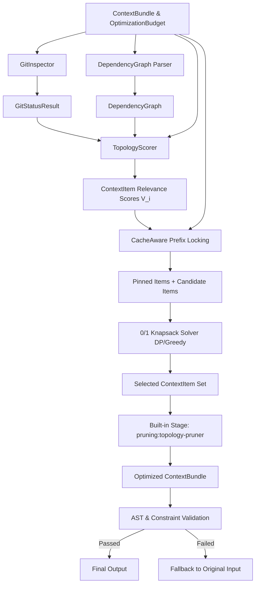

# Architectural Specification: Milestone 5 — Workspace Topology Pruning & 0/1 Knapsack Planner

## Executive Summary

This document serves as the canonical architectural specification for **Milestone 5: Workspace Topology Pruning & 0/1 Knapsack Planner** in TokenDamper.

TokenDamper optimizes AI assistant context under strict token and latency budgets. In Milestone 5, TokenDamper transitions from uniform context handling to **topology-aware context pruning** and **optimal token knapsack allocation**.

By combining **Git workspace status**, **code dependency graph distance** (for TypeScript/JavaScript and Python), **cache-aware prompt prefix locking**, and a **0/1 Knapsack optimization algorithm**, TokenDamper maximizes context item utility within `budget.maxInputTokens` while guaranteeing prompt cache compatibility and zero constraint violation.

---

## Architecture Diagram & Data Flow



### Execution Flow Step-by-Step

1. **Adapter / Request Parsing**: The engine receives an `OptimizationRequest` containing a `ContextBundle` and `OptimizationBudget`.
2. **Git Workspace Inspection (`git-inspector.ts`)**: Scans the workspace directory to identify modified, untracked, and recently modified files.
3. **Dependency Graph Parsing (`dependency-graph.ts`)**: Constructs a directed import/export dependency graph across TypeScript/JavaScript and Python code items.
4. **Topology Scoring (`topology-scorer.ts`)**: Calculates a composite relevance score $V_i \in [1.0, 100.0]$ for each `ContextItem` based on graph distance to modified files, git status, item kind, and imperative directives.
5. **Cache-Aware Prefix Locking (`cache-aware.ts`)**: Identifies system prompts, mandatory constraint items, and initial prompt cache horizon items ($1,024$-token boundaries), pinning them so they bypass knapsack elimination.
6. **0/1 Knapsack Optimization (`knapsack.ts`)**: Runs a 0/1 Knapsack algorithm (Dynamic Programming with bounded array or Density Greedy fallback) to select the subset of candidate items that maximizes total score within residual `budget.maxInputTokens`.
7. **Stage Execution (`pruning:topology-pruner.ts`)**: Reconstructs an immutable `ContextBundle` containing only selected and pinned items.
8. **Validation & Fallback**: Validates AST syntax and constraint retention. Triggers explicit fallback if validation fails.

---

## Core Module Specifications

### 1. `src/core/topology/git-inspector.ts`

#### Responsibilities
Inspects local Git workspace status safely and deterministically without throwing uncaught runtime errors. Identifies dirty/modified files, staged files, untracked files, and recent edit distances.

#### Data Interfaces

```typescript
export interface GitStatusResult {
  readonly isGitRepo: boolean;
  readonly repoRoot: string | null;
  readonly modifiedFiles: ReadonlySet<string>;
  readonly stagedFiles: ReadonlySet<string>;
  readonly untrackedFiles: ReadonlySet<string>;
  readonly allDirtyFiles: ReadonlySet<string>;
  readonly recentCommitFiles: ReadonlyMap<string, number>; // path -> commit age (0 = latest commit)
}
```

#### Key Functions

```typescript
/**
 * Inspects Git workspace status for a given root directory.
 * If git is not installed or the directory is not a git repository,
 * returns a safe default GitStatusResult with isGitRepo = false.
 */
export function inspectGitWorkspace(workspaceRoot?: string): GitStatusResult;

/**
 * Normalizes file paths to POSIX style (forward slashes) relative to repository root.
 */
export function normalizeGitPath(filePath: string, repoRoot?: string): string;
```

#### Behavior & Requirements
- **Command Execution**: Uses `child_process.execSync` with `git status --porcelain` and `git log --name-only -n 5` with a short timeout ($500\text{ms}$).
- **Fault Tolerance**: Must catch all subprocess errors (e.g. `git` executable missing, non-git directory, timeout) and return a safe default object (`isGitRepo: false`, empty sets).
- **Path Normalization**: Replaces Windows backslashes `\` with `/` and strips leading `./` to match `ContextItem.path`.

---

### 2. `src/core/topology/dependency-graph.ts`

#### Responsibilities
Parses import and export statements in TypeScript/JavaScript and Python source code items, building a directed dependency graph to measure structural proximity between files.

#### Data Interfaces

```typescript
export interface DependencyNode {
  readonly path: string;
  readonly language: 'typescript' | 'javascript' | 'python' | 'unknown';
  readonly imports: ReadonlySet<string>; // Relative paths of imported files
  readonly exports: ReadonlySet<string>; // Exported symbol names
}

export interface DependencyGraph {
  readonly nodes: ReadonlyMap<string, DependencyNode>;
  readonly edges: ReadonlyMap<string, ReadonlySet<string>>; // sourcePath -> Set<targetPath>
  readonly reverseEdges: ReadonlyMap<string, ReadonlySet<string>>; // targetPath -> Set<sourcePath>
}
```

#### Key Functions

```typescript
/**
 * Parses ESM/CJS import statements from TS/JS code content.
 */
export function parseTsJsImports(filePath: string, content: string): ReadonlySet<string>;

/**
 * Parses import/from statements from Python code content.
 */
export function parsePythonImports(filePath: string, content: string): ReadonlySet<string>;

/**
 * Constructs a DependencyGraph from a list of ContextItems.
 */
export function buildDependencyGraph(items: ReadonlyArray<ContextItem>): DependencyGraph;

/**
 * Calculates the shortest path distance (BFS) from any source path in sourcePaths to targetPath.
 * Returns 0 if targetPath is in sourcePaths.
 * Returns Infinity if targetPath is disconnected from sourcePaths.
 */
export function getShortestGraphDistance(
  graph: DependencyGraph,
  sourcePaths: ReadonlySet<string>,
  targetPath: string,
): number;
```

#### Parsing Rules
- **TypeScript/JavaScript**:
  - Matches `import ... from '...'` and `require('...')`.
  - Matches `export ... from '...'`.
  - Resolves relative imports (`./foo`, `../utils`) relative to `filePath` directory.
- **Python**:
  - Matches `import foo` and `from foo import bar`.
  - Converts module dot notation (`foo.bar`) to path notation (`foo/bar.py`).

---

### 3. `src/core/topology/topology-scorer.ts`

#### Responsibilities
Calculates a numeric relevance value $V_i \in [1.0, 100.0]$ for each `ContextItem`. High values indicate critical items that must be prioritized in the prompt context.

#### Scoring Model & Mathematical Formula

For context item $i$:

$$V_i = \text{clamp}\left( S_{\text{graph}}(i) + S_{\text{git}}(i) + S_{\text{kind}}(i) + S_{\text{constraint}}(i), 1.0, 100.0 \right)$$

1. **Graph Distance Score ($S_{\text{graph}}$)**:
   $$S_{\text{graph}}(i) = \begin{cases} 
   40.0 & \text{if } d_i = 0 \text{ (modified/target file)} \\
   30.0 & \text{if } d_i = 1 \text{ (direct dependency/import)} \\
   20.0 & \text{if } d_i = 2 \text{ (2-hop dependency)} \\
   10.0 & \text{if } 3 \le d_i < \infty \\
   5.0 & \text{if } d_i = \infty \text{ (disconnected file)}
   \end{cases}$$
   where $d_i$ is shortest graph distance to any dirty/modified file.

2. **Git Status Score ($S_{\text{git}}$)**:
   $$S_{\text{git}}(i) = \begin{cases} 
   30.0 & \text{if item path is dirty (modified/staged/untracked)} \\
   15.0 & \text{if item path was changed in recent commits} \\
   0.0 & \text{otherwise}
   \end{cases}$$

3. **Kind & Role Base Score ($S_{\text{kind}}$)**:
   $$S_{\text{kind}}(i) = \begin{cases} 
   30.0 & \text{if } \text{role} = \text{'system'} \text{ or } \text{kind} = \text{'prompt'} \\
   20.0 & \text{if } \text{kind} = \text{'conversation'} \\
   15.0 & \text{if } \text{kind} = \text{'file'} \\
   10.0 & \text{if } \text{kind} = \text{'diff'} \\
   5.0 & \text{otherwise}
   \end{cases}$$

4. **Constraint Preservation Score ($S_{\text{constraint}}$)**:
   $$S_{\text{constraint}}(i) = \begin{cases} 
   25.0 & \text{if item contains imperative keywords ("MUST", "NEVER", "ONLY IF", "DO NOT")} \\
   0.0 & \text{otherwise}
   \end{cases}$$

#### Data Interfaces

```typescript
export interface ItemTopologyScore {
  readonly itemId: string;
  readonly score: number; // Clamp(1.0, 100.0)
  readonly graphDistance: number;
  readonly isDirty: boolean;
  readonly hasConstraints: boolean;
  readonly isPinned: boolean;
}

export type TopologyScoreMap = ReadonlyMap<string, ItemTopologyScore>;
```

#### Key Functions

```typescript
/**
 * Scores all items in a context bundle using Git status, dependency graph, and constraint analysis.
 */
export function scoreBundleTopology(
  bundle: ContextBundle,
  gitStatus: GitStatusResult,
  graph: DependencyGraph,
  budget: OptimizationBudget,
): TopologyScoreMap;
```

---

### 4. `src/core/planner/knapsack.ts`

#### Responsibilities
Solves the 0/1 Knapsack problem to maximize the sum of item topology scores subject to the token budget `budget.maxInputTokens`. Handles pinned items separately to guarantee zero violation of mandatory items.

#### Mathematical Problem Statement

Given candidate items $C = \{1, 2, \dots, N\}$ with weights $w_i = \text{tokens}(i)$ and values $v_i = V_i$:

$$\text{Maximize } \sum_{i \in S} v_i \quad \text{subject to} \quad \sum_{i \in S} w_i \le W_{\text{residual}}$$

where $W_{\text{residual}} = W_{\text{maxInputTokens}} - \sum_{p \in P} w_p$, and $P$ is the set of pinned items.

#### Optimization Algorithm Specification

1. **Pinned Item Reservation**:
   - Collect all pinned items $P$ (`isPinned === true`).
   - Sum pinned weight $W_P = \sum_{p \in P} w_p$.
   - Compute residual capacity $W_{\text{residual}} = \max(0, W_{\text{maxInputTokens}} - W_P)$.

2. **Knapsack Algorithm Selection**:
   - **Dynamic Programming (DP)**: Used when candidate count $N \le 100$ and $W_{\text{residual}} \le 10,000$.
     - Employs 1D array DP space optimization: $DP[w] = \max(DP[w], DP[w - w_i] + v_i)$.
     - Complexity: $O(N \cdot W)$, space $O(W)$.
   - **Density Greedy + Branch & Bound Fallback**: Used when $W_{\text{residual}} > 10,000$ or $N > 100$.
     - Sorts candidate items by efficiency ratio $e_i = \frac{v_i}{w_i}$ in descending order.
     - Selects candidate items greedily until $W_{\text{residual}}$ is exhausted.
     - Runs lightweight local branch-and-bound swap check to prevent greedy edge gaps.
     - Complexity: $O(N \log N)$, space $O(N)$.

#### Data Interfaces

```typescript
export interface KnapsackItem {
  readonly id: string;
  readonly itemId: string;
  readonly weight: number; // Token estimate
  readonly value: number; // Relevance score V_i
  readonly isPinned: boolean;
  readonly kind: ContextItemKind;
}

export interface KnapsackResult {
  readonly selectedItemIds: ReadonlySet<string>;
  readonly totalWeight: number;
  readonly totalValue: number;
  readonly pinnedWeight: number;
  readonly candidateWeight: number;
  readonly overflowTokens: number;
  readonly strategyUsed: 'dp' | 'greedy_density' | 'pass_through';
}
```

#### Key Functions

```typescript
/**
 * Solves the 0/1 Knapsack problem for context items under a maximum token budget.
 */
export function solve01Knapsack(
  items: ReadonlyArray<KnapsackItem>,
  maxTokens: number,
): KnapsackResult;
```

---

### 5. `src/core/planner/cache-aware.ts`

#### Responsibilities
Protects LLM provider prompt caches (Anthropic Claude and OpenAI GPT-4o) by enforcing prefix stability rules and rounding prefix boundaries to $1,024$-token cache block limits.

#### Prompt Cache Boundaries & Rules

- **Anthropic Claude**: $1,024$-token minimum cache block size. Breakpoints placed at explicit headers.
- **OpenAI**: Prefix matching starting at token index 0.

#### Cache Boundary Rules

1. **System Prompt Pinning**: System prompt items (`role === 'system'`) and tool definitions are unconditionally pinned (`isPinned = true`) at index 0.
2. **Prefix Horizon Pinning**: The initial sequence of items up to a configurable token threshold $L_{\text{prefix}}$ (default: $1,024$ tokens) is marked `isPinned = true` to preserve prompt cache hits across turns.
3. **Preserved Kinds**: Items matching `budget.preserveKinds` are marked `isPinned = true`.
4. **Constraint Items**: Items with imperative directives are marked `isPinned = true`.

#### Data Interfaces

```typescript
export interface CacheAwareConfig {
  readonly provider: 'anthropic' | 'openai' | 'generic';
  readonly minCacheBlockTokens: number; // Default: 1024
  readonly prefixPinHorizonTokens: number; // Default: 1024
}
```

#### Key Functions

```typescript
/**
 * Applies cache-aware prefix locking to context items before knapsack selection.
 * Returns an array of KnapsackItems with updated isPinned flags.
 */
export function applyCacheAwarePrefixLocking(
  items: ReadonlyArray<ContextItem>,
  scores: TopologyScoreMap,
  budget: OptimizationBudget,
  config?: Partial<CacheAwareConfig>,
): ReadonlyArray<KnapsackItem>;
```

---

### 6. `src/stages/pruning/topology-pruner.ts`

#### Responsibilities
Implements the built-in stage `pruning:topology-pruner`. Orchestrates workspace git inspection, dependency parsing, topology scoring, cache prefix locking, and 0/1 knapsack pruning.

#### Stage Definition
- **Stage ID**: `pruning:topology-pruner`
- **Version**: `0.1.0`

#### Behavior
1. Parses git status and builds dependency graph.
2. Scores bundle items.
3. Locks prompt cache prefixes.
4. Solves 0/1 knapsack allocation for `budget.maxInputTokens`.
5. Removes unselected candidate items from `ContextBundle`.
6. Calculates stage metrics (`itemsPruned`, `tokensSaved`, `graphDistanceAvg`, `knapsackStrategy`, `cachePrefixPinCount`).
7. Emits updated `StageResult` with new immutable `ContextBundle`.

#### Code Signature

```typescript
export function runTopologyPrunerStage(
  bundle: ContextBundle,
  budget: OptimizationBudget,
  workspaceRoot?: string,
): StageResult;
```

---

## System Integration Specifications

### 1. `src/core/model/types.ts` Update

Update `OptimizationMode` to include `'topology_knapsack'`:

```typescript
export type OptimizationMode = 'pass_through' | 'topology_knapsack';
```

---

### 2. `src/core/planner/index.ts` Update

Update `plan()` to select `'topology_knapsack'` mode when `budget.maxInputTokens` is specified:

```typescript
export function plan(
  bundle: ContextBundle,
  budget: OptimizationBudget,
  config: ResolvedConfig,
  stageCatalog: ReadonlyArray<BuiltInStageDefinition>,
): OptimizationPlan {
  validatePlannerInputs(bundle, budget, config);

  const isKnapsackMode = typeof budget.maxInputTokens === 'number' && budget.maxInputTokens > 0;
  const mode: OptimizationMode = isKnapsackMode ? 'topology_knapsack' : 'pass_through';

  const stageIds: string[] = [];
  if (isKnapsackMode) {
    stageIds.push('cleanup:constraint-preservation');
    stageIds.push('pruning:topology-pruner');
  }

  return {
    planId: `${bundle.bundleId}:${mode}`,
    mode,
    stageIds: Object.freeze(stageIds),
    revalidationPoints: Object.freeze(['end']),
    fallbackPolicy: 'original_input',
    expectedSavings: isKnapsackMode ? 0.3 : 0,
  };
}
```

---

### 3. `src/core/stage-registry/index.ts` Update

Register `pruning:topology-pruner` in the built-in stage catalog and expose stage runner mapping:

```typescript
export function getBuiltInStageCatalog(): ReadonlyArray<BuiltInStageDefinition> {
  return Object.freeze([
    { stageId: 'cleanup:session-dedup', version: '0.1.0' },
    { stageId: 'cleanup:constraint-preservation', version: '0.1.0' },
    { stageId: 'pruning:topology-pruner', version: '0.1.0' },
  ]);
}
```

---

### 4. `src/core/engine/index.ts` Update

Update `optimize()` function to execute plan stages in linear sequence:

```typescript
export function optimize(request: OptimizationRequest): OptimizationResult {
  const stageCatalog = getBuiltInStageCatalog();
  const selectedPlan = plan(request.bundle, request.budget, request.config, stageCatalog);
  const stageResults: StageResult[] = [];
  let currentBundle = request.bundle;

  for (const stageId of selectedPlan.stageIds) {
    const result = executeStage(stageId, currentBundle, request.budget);
    stageResults.push(result);
    if (result.status === 'ok' && result.changed) {
      currentBundle = result.bundle;
    } else if (result.status === 'failed') {
      // Trigger immediate fallback on stage failure
      break;
    }
  }

  const validation = createValidationReport(
    validate(request.bundle, currentBundle, selectedPlan, request.budget),
  );
  const fallback = resolveFallback(request, validation);
  const emittedOutput = fallback.output;
  const trace = buildTrace(request, selectedPlan, stageResults, validation, fallback, emittedOutput);

  return createOptimizationResult({
    finalBundle: currentBundle,
    emittedOutput,
    validation,
    trace,
    fallbackUsed: fallback.used,
  });
}
```

---

## Detailed Instructions for the Engineer Agent

### Step 1: Topology Inspector & Parsers
1. Create `src/core/topology/git-inspector.ts`. Implement safe `execSync` git parsing with complete error trapping.
2. Create `src/core/topology/dependency-graph.ts`. Implement regex-based parsers for TypeScript (`import`, `require`, `export`) and Python (`import`, `from ... import`). Implement BFS graph distance `getShortestGraphDistance`.
3. Create `src/core/topology/topology-scorer.ts`. Implement `scoreBundleTopology` using the scoring formula above.

### Step 2: Knapsack Solver & Cache-Aware Locking
1. Create `src/core/planner/knapsack.ts`. Implement 0/1 DP and Density-Greedy solvers. Guarantee pinned item preservation.
2. Create `src/core/planner/cache-aware.ts`. Implement `applyCacheAwarePrefixLocking` with system prompt pinning and $1,024$-token boundary alignment.

### Step 3: Built-in Pruning Stage
1. Create `src/stages/pruning/topology-pruner.ts`. Implement `runTopologyPrunerStage`.
2. Ensure stage returns a fresh, immutable `ContextBundle` and complete `StageResult` metrics.

### Step 4: Core Wiring & Integration
1. Modify `src/core/model/types.ts` to add `'topology_knapsack'` to `OptimizationMode`.
2. Modify `src/core/planner/index.ts` to select `'topology_knapsack'` mode when `maxInputTokens` budget is specified.
3. Modify `src/core/stage-registry/index.ts` to include `pruning:topology-pruner`.
4. Modify `src/core/engine/index.ts` to execute plan stages in linear sequence.

### Step 5: Verification & Unit Tests
1. Add unit tests for git inspector, dependency graph parser, topology scorer, knapsack solver, cache-aware prefix locking, and topology pruner stage.
2. Run `npm test` and `npm run build` to verify clean compilation and 100% test pass rate.

---

## Architectural Invariants Checklist

- [x] **Immutable Domain Objects**: `ContextBundle` and `OptimizationBudget` instances are strictly read-only and immutable.
- [x] **Stateless Planner**: `plan()` selects execution plans deterministically from inputs without side effects.
- [x] **Explicit Fallback**: If AST validation fails or imperative constraints are lost after pruning, immediate fallback to raw input occurs.
- [x] **Prompt-Cache Stability**: System prompt and prefix horizon ($1,024$ tokens) are strictly locked to preserve Anthropic/OpenAI prompt cache boundaries.
- [x] **Linear Pipeline Orchestration**: Stages execute in linear sequence with zero DAG scheduling.
