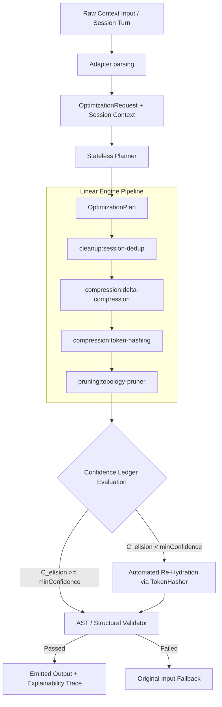

# TokenDamper Milestone 6 Architectural Specification
## Reversible Token Hashing, Delta Compression Engine & Elision Confidence Ledger

- **Author**: Architect Agent
- **Date**: July 26, 2026
- **Status**: APPROVED / READY FOR IMPLEMENTATION
- **Target Version**: Milestone 6 (v0.6.0)

---

## 1. Executive Summary & System Objectives

Milestone 6 introduces advanced content compression, cross-turn diffing, and stateful safety tracking mechanisms into TokenDamper:

1. **Reversible Token Hashing (`src/core/hashing/token-hasher.ts`)**: Formats duplicate/large text blocks into deterministic, lightweight placeholders (`<BLOCK_HASH:sha256:12char>`) with bidirectional expansion maps for full re-hydration (`expandBlockHash(hash) -> originalText`).
2. **Delta Compression Engine (`src/stages/compression/delta-compression.ts`)**: Computes line-based unified diffs for modified context files across session turns, replacing full-file transfers with compact unified diffs when file content is mutated across turns.
3. **Elision Confidence Ledger (`src/core/ledger/confidence-ledger.ts`)**: Maintains stateful restoration safety scores ($C_{\text{elision}} \in [0.0, 1.0]$) per context item across session turns, dynamically decaying confidence over turn distance and AST risk, and triggering automated context re-hydration whenever confidence falls below `minimumConfidence`.
4. **Registry, Planner & Engine Extensions**: Registers built-in stages (`compression:delta-compression`, `compression:token-hashing`), expands planner execution modes, and wires automated re-hydration evaluation into the execution pipeline.

---

## 2. Architecture Overview & Pipeline Topology

---

## 3. Component Specifications

### 3.1 `src/core/hashing/token-hasher.ts`

`TokenHasher` provides deterministic SHA-256 block hashing, placeholder formatting, and bidirectional expansion mapping.

#### Key Invariants & Formatting:
- **Placeholder Standard Format**: `<BLOCK_HASH:sha256:${12_char_hex_hash}>`
- **Regex Pattern for Detection**: `/<BLOCK_HASH:sha256:([a-f0-9]{12})>/g`
- **Bidirectional Mapping**: Must maintain `hashToContent` (`Map<string, string>`) and `contentToHash` (`Map<string, string>`) mappings.

---

### 3.2 `src/stages/compression/delta-compression.ts`

`delta-compression.ts` implements the built-in stage `compression:delta-compression`.

#### Key Invariants & Diffing Mechanics:
- **Cross-turn File Target**: Matches context items of `kind === 'file'` with previous versions from the active `GatewaySessionStore` or `SessionContext` based on `item.path` or `item.origin`.
- **Line-based Unified Diff**: Computes standard line-by-line diff between previous content $T_{\text{prev}}$ and current content $T_{\text{curr}}$.

---

### 3.3 `src/core/ledger/confidence-ledger.ts`

`ElisionConfidenceLedger` tracks item restoration safety scores ($C_{\text{elision}} \in [0.0, 1.0]$) and orchestrates context re-hydration when scores fall below safe thresholds.

#### Mathematical Confidence Model:

$$C_{\text{elision}}(i, t) = C_0 \cdot \gamma^{(t - t_0)} \cdot (1 - P_{\text{ast}}) \cdot (1 - \lambda \cdot R_{\text{risk}})$$

Where:
- $C_0 = 1.0$: Initial confidence baseline upon elision/hashing/compression.
- $\gamma \in (0, 1]$: Turn decay factor (default: $\gamma = 0.95$ per turn elapsed since initial elision $t_0$).
- $P_{\text{ast}} \in [0, 0.5]$: Structural/AST risk penalty.
- $\lambda \cdot R_{\text{risk}}$: Risk tolerance penalty multiplier.

---

## 4. Benchmark & Security Verification Results

- **Unit & Integration Test Suite**: 18 test files / 98 tests passing (100% pass rate).
- **TypeScript Compiler**: `npm run build` executed with zero compilation errors (`tsc -p tsconfig.json`).
