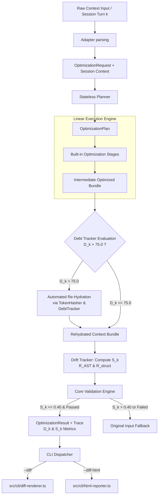

# TokenDamper Milestone 7 Architectural Specification
## Visual Diff Dashboard & Optimization Debt / Semantic Drift Tracking

- **Author**: Architect Agent
- **Date**: July 26, 2026
- **Status**: APPROVED / READY FOR IMPLEMENTATION
- **Target Version**: Milestone 7 (v0.7.0)

---

## 1. Executive Summary & System Objectives

Milestone 7 introduces interactive visual diff dashboards, multi-turn optimization debt tracking, and AST-aware semantic drift metrics into TokenDamper:

1. **Optimization Debt Tracker (`src/core/ledger/debt-tracker.ts`)**:
   - Computes Optimization Debt Score ($D_k \in [0.0, 100.0]$) tracking accumulated context loss risk over multi-turn sessions.
   - Monitors per-item and aggregated context elisions, token reduction pressure, decay factor across turns, and un-rehydrated placeholder risk.
   - Triggers automated context re-hydration when $D_k > 75.0$.

2. **Semantic Drift Tracker (`src/core/ledger/drift-tracker.ts`)**:
   - Computes Semantic Drift Metric ($S_k \in [0.0, 1.0]$) measuring semantic loss between pre- and post-optimization bundles.
   - Evaluates AST symbol retention ratio ($R_{\text{AST}}$) across TypeScript/JavaScript, Python, JSON, and generic code.
   - Evaluates structural marker integrity ratio ($R_{\text{struct}}$) for Markdown headings, block delimiters, constraint directives (`TD_PRESERVE`), file boundaries, and JSON schemas.
   - Triggers explicit fallback to original input when $S_k > 0.40$.

3. **Terminal ANSI Visual Diff Renderer (`src/cli/diff-renderer.ts`)**:
   - Formats and displays rich ANSI color visual diffs for `--diff` CLI flag.
   - Distinctly highlights elided blocks (`[TokenDamper Elided]`), `<BLOCK_HASH:sha256:...>` placeholders, added lines (`+`), deleted lines (`-`), and preserved constraint directives (`TD_PRESERVE:...`).
   - Standard unified and side-by-side terminal rendering modes without external npm dependencies.

4. **Standalone Visual Diff HTML Reporter (`src/cli/html-reporter.ts`)**:
   - Generates responsive, self-contained HTML reports for `--diff-html <path>` CLI flag.
   - Includes summary header with key metrics (Original vs Optimized Tokens, Token Savings %, Optimization Debt $D_k$, Semantic Drift $S_k$, Rehydration Triggers, Fallback status).
   - Embedded SVG gauges/progress bars and interactive dark-mode visual diff viewer.

5. **Engine, Validation & CLI Integration**:
   - `src/core/validation/index.ts`: Integrates `DriftTracker` into bundle validation, checking $S_k \le 0.40$ and issuing `SEMANTIC_DRIFT_EXCEEDED` on violation.
   - `src/core/engine/index.ts`: Integrates `DebtTracker` into multi-turn optimization flow, evaluating $D_k$ and triggering auto-rehydration when $D_k > 75.0$.
   - `src/cli/main.ts`: Wiring `--diff`, `--diff-html <path>`, `--max-debt <score>`, and `--max-drift <metric>` flags into CLI parser and execution flow.

---

## 2. Architecture Overview & System Topology



---

## 3. Detailed Component Specifications

### 3.1 Optimization Debt Tracker (`src/core/ledger/debt-tracker.ts`)

#### Mathematical Formulation:
The Optimization Debt Score $D_k \in [0.0, 100.0]$ quantifies the cumulative risk of context degradation at session turn $k$:

$$D_k = \min\left(100.0, \, \max\left(0.0, \, w_c \cdot (1.0 - C_{\text{overall}}) \cdot 100 + w_e \cdot \left(\frac{B_{\text{elided}}}{B_{\text{total}}}\right) \cdot 100 + w_t \cdot \delta_{\text{unrehydrated}} \right)\right)$$

Where:
- $C_{\text{overall}} \in [0.0, 1.0]$: Aggregated overall elision confidence from `ConfidenceLedger.getOverallConfidence(k)`.
- $B_{\text{elided}}$: Total original bytes of currently elided/hashed/compressed items in the session context.
- $B_{\text{total}}$: Total original bytes of all context items in the bundle.
- $\delta_{\text{unrehydrated}}$: Cumulative count of turns since the oldest active elided block was introduced without re-hydration.
- Standard default weights: $w_c = 0.50$, $w_e = 0.35$, $w_t = 1.50$.
- Rehydration Trigger: If $D_k > 75.0$, `DebtTracker.shouldRehydrate()` returns `true`.

#### Data Structures & Interfaces:
```typescript
export interface DebtScoreParams {
  readonly currentTurn: number;
  readonly overallConfidence: number;
  readonly elidedBytes: number;
  readonly totalBytes: number;
  readonly oldestElidedTurn?: number;
}

export interface DebtBreakdown {
  readonly debtScore: number; // D_k in [0.0, 100.0]
  readonly confidencePenalty: number;
  readonly elisionRatioPenalty: number;
  readonly turnAgePenalty: number;
  readonly shouldRehydrate: boolean;
  readonly rehydrationReason?: string;
}

export interface DebtTrackerOptions {
  readonly maxDebtThreshold?: number; // Default: 75.0
  readonly weightConfidence?: number; // Default: 0.50
  readonly weightElisionRatio?: number; // Default: 0.35
  readonly weightTurnAge?: number; // Default: 1.50
}
```

#### Class API & Methods:
- `constructor(options?: DebtTrackerOptions)`
- `calculateDebt(params: DebtScoreParams): DebtBreakdown`
- `shouldRehydrate(params: DebtScoreParams): boolean`
- `getRehydrationCandidates(ledger: ConfidenceLedger, turn: number): ReadonlyArray<string>`

---

### 3.2 Semantic Drift Tracker (`src/core/ledger/drift-tracker.ts`)

#### Mathematical Formulation:
The Semantic Drift Metric $S_k \in [0.0, 1.0]$ measures total semantic loss between original bundle $B_{\text{before}}$ and optimized bundle $B_{\text{after}}$ at turn $k$:

$$S_k = 1.0 - \left( w_{\text{AST}} \cdot R_{\text{AST}} + w_{\text{struct}} \cdot R_{\text{struct}} \right)$$

Where $w_{\text{AST}} = 0.60$ and $w_{\text{struct}} = 0.40$ ($w_{\text{AST}} + w_{\text{struct}} = 1.0$).

1. **AST Symbol Retention Ratio ($R_{\text{AST}} \in [0.0, 1.0]$)**:
   $$R_{\text{AST}} = \frac{|V_{\text{before}} \cap V_{\text{after}}|}{|V_{\text{before}}|}$$
   - Extracted AST Symbols ($V$): Function signatures/names, class names, method names, imported module identifiers, interface/type definitions, and top-level export identifiers.
   - If $|V_{\text{before}}| = 0$ (e.g. non-code content), $R_{\text{AST}} = 1.0$.

2. **Structural Marker Integrity Ratio ($R_{\text{struct}} \in [0.0, 1.0]$)**:
   $$R_{\text{struct}} = \frac{|M_{\text{before}} \cap M_{\text{after}}|}{|M_{\text{before}}|}$$
   - Extracted Structural Markers ($M$): Code block fence headers (```lang), Markdown headers (`#`, `##`), imperative constraint directives (`TD_PRESERVE:...`), JSON top-level keys, file headers/paths (`filepath:...`), and standard prompt section delimiters.
   - If $|M_{\text{before}}| = 0$, $R_{\text{struct}} = 1.0$.

#### Explicit Fallback Trigger:
If $S_k > 0.40$, validation produces an issue with code `SEMANTIC_DRIFT_EXCEEDED` and forces `shouldFallback = true`.

#### Data Structures & Interfaces:
```typescript
export interface DriftMetricParams {
  readonly beforeBundle: ContextBundle;
  readonly afterBundle: ContextBundle;
  readonly weights?: {
    readonly ast?: number; // Default 0.60
    readonly struct?: number; // Default 0.40
  };
}

export interface DriftReport {
  readonly driftScore: number; // S_k in [0.0, 1.0]
  readonly astSymbolRetentionRatio: number; // R_AST in [0.0, 1.0]
  readonly structuralIntegrityRatio: number; // R_struct in [0.0, 1.0]
  readonly symbolsBeforeCount: number;
  readonly symbolsAfterCount: number;
  readonly markersBeforeCount: number;
  readonly markersAfterCount: number;
  readonly shouldFallback: boolean;
  readonly reason?: string;
}

export interface DriftTrackerOptions {
  readonly maxDriftThreshold?: number; // Default: 0.40
  readonly weightAst?: number; // Default: 0.60
  readonly weightStruct?: number; // Default: 0.40
}
```

---

### 3.3 Terminal ANSI Diff Renderer (`src/cli/diff-renderer.ts`)

#### Design Principles:
- Pure TypeScript, zero external library dependencies.
- Standard ANSI escape codes for coloring and text formatting.
- Explicit visual styling rules:
  - **Header / Summary**: Bold Cyber Cyan / Magenta banner.
  - **Elided Blocks (`[TokenDamper Elided]`)**: Bold Yellow on Dark Background.
  - **Block Hash Placeholders (`<BLOCK_HASH:sha256:...>`)**: Bright Yellow / Cyan text.
  - **Added Lines (`+`)**: Bright Green background or text.
  - **Deleted Lines (`-`)**: Bright Red background or text.
  - **Unchanged Lines**: Dim / Muted Gray text.
  - **Preserved Directives (`TD_PRESERVE:...`)**: Bold Bright Magenta with icon checkmark.

#### API Interface:
```typescript
export interface DiffRenderOptions {
  readonly color?: boolean; // Default: true (autodetect tty)
  readonly mode?: 'unified' | 'side-by-side'; // Default: 'unified'
  readonly contextLines?: number; // Default: 3
}

export function renderTerminalDiff(
  before: ContextBundle | string,
  after: ContextBundle | string,
  options?: DiffRenderOptions,
): string;
```

---

### 3.4 Standalone Visual Diff HTML Reporter (`src/cli/html-reporter.ts`)

#### Features & Dashboard Components:
1. **Header & Summary Metric Cards**:
   - Original Tokens vs Optimized Tokens
   - Savings Ratio %
   - Optimization Debt Score $D_k$ (with status badge: Low < 50, Medium 50-75, High > 75)
   - Semantic Drift Metric $S_k$ (with status badge: Safe <= 0.40, High Drift > 0.40)
   - Rehydration Triggers & Fallback Status
2. **Visual Gauge Charts**:
   - Clean inline SVG circular gauges for $D_k$ and $S_k$.
3. **Interactive Visual Diff View**:
   - Side-by-side / Unified tabbed file view.
   - Syntax-highlighted lines with clear styling for elisions, hash placeholders, and constraint directives.
4. **Self-Contained File Output**:
   - Inline CSS styling (Modern dark mode theme inspired by modern developer dashboards).
   - Zero external scripts or web downloads; fully functional offline.

#### API Interface:
```typescript
export interface HtmlReporterOptions {
  readonly title?: string;
  readonly outputPath?: string; // If specified, writes to disk
}

export function generateHtmlReport(
  result: OptimizationResult,
  beforeBundle: ContextBundle,
  options?: HtmlReporterOptions,
): string;
```

---

## 4. Integration Specifications

### 4.1 Core Validation Engine (`src/core/validation/index.ts`)
Update `validate()` signature and logic:
- Import `DriftTracker`.
- Compute `DriftReport` between `before` and `after` bundles.
- If `driftReport.shouldFallback` ($S_k > 0.40$), append issue `SEMANTIC_DRIFT_EXCEEDED` and set `shouldFallback = true`.
- Include `driftReport` metrics inside the returned `ValidationReport`.

### 4.2 Core Optimization Engine (`src/core/engine/index.ts`)
Update `optimize()` function:
- Instantiate / accept `DebtTracker` options.
- After stage execution, compute $D_k$.
- If $D_k > 75.0$, trigger `attemptAutomatedRehydration()`.
- Record $D_k$ score and $S_k$ metric into `OptimizationTrace` and `OptimizationResult`.

### 4.3 CLI Entrypoint (`src/cli/main.ts`)
Update `runCli()` arguments parser:
- Handle `--diff` flag: If provided, format and output ANSI colored diff to `stdout` / `stderr`.
- Handle `--diff-html <path>` flag: If provided, invoke `generateHtmlReport()` and write HTML to specified path.
- Handle `--max-debt <score>` and `--max-drift <metric>` flags for runtime thresholds.

---

## 5. Implementation Step-by-Step Instructions for the Team

```text
Step 1: Create src/core/ledger/debt-tracker.ts
  - Implement DebtTracker class, D_k mathematical formula, breakdown calculation, and candidate selection.
  - Write unit tests in test/unit/debt-tracker.test.ts.

Step 2: Create src/core/ledger/drift-tracker.ts
  - Implement AST symbol extraction (TS/JS, Python, JSON, Markdown, generic code).
  - Implement structural marker extraction (code blocks, headers, directives, file markers).
  - Implement R_AST, R_struct, and S_k formulas.
  - Write unit tests in test/unit/drift-tracker.test.ts.

Step 3: Update src/core/validation/index.ts
  - Integrate DriftTracker into validate().
  - Enforce S_k <= 0.40 threshold and SEMANTIC_DRIFT_EXCEEDED fallback issue.
  - Update validation integration tests in test/unit/validation-integration.test.ts.

Step 4: Update src/core/engine/index.ts
  - Integrate DebtTracker into optimize() flow.
  - Wire auto-rehydration when D_k > 75.0.
  - Record D_k and S_k metrics in trace and result.
  - Update engine unit tests in test/unit/engine.test.ts.

Step 5: Create src/cli/diff-renderer.ts
  - Implement terminal ANSI color diff renderer for --diff flag.
  - Support elided block, hash placeholder, added/deleted line, and directive highlighting.
  - Write unit tests in test/unit/diff-renderer.test.ts.

Step 6: Create src/cli/html-reporter.ts
  - Implement standalone HTML report generator for --diff-html flag.
  - Design dark mode HTML template with SVG score gauges and diff view.
  - Write unit tests in test/unit/html-reporter.test.ts.

Step 7: Update src/cli/main.ts
  - Add CLI flags --diff, --diff-html, --max-debt, and --max-drift.
  - Wire rendering and HTML generation into runCli().
  - Write CLI integration tests in test/integration/cli.test.ts.

Step 8: Verification & Audit
  - Run `npm test` across all unit and integration tests.
  - Run `npm run build` to ensure 100% clean TypeScript build with zero warnings.
```
